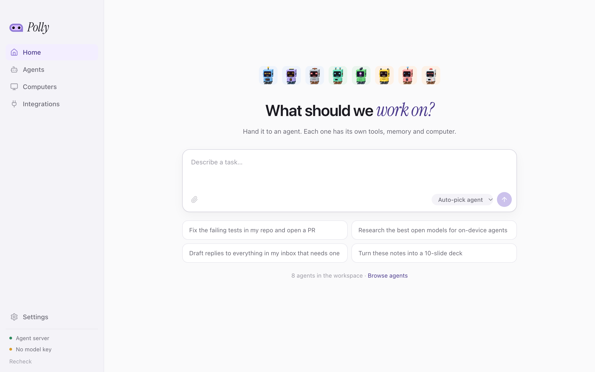
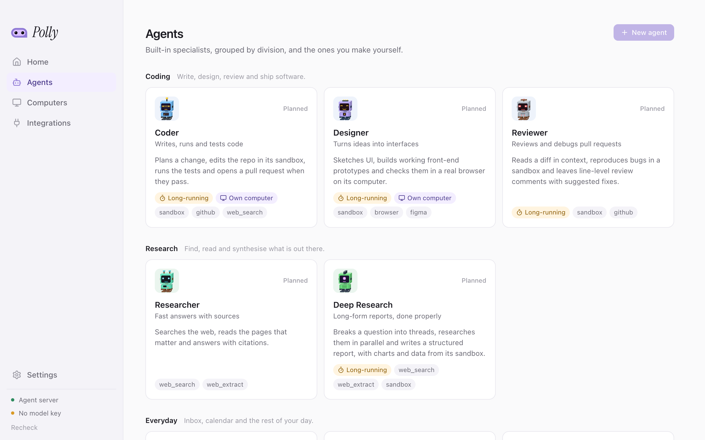

<p align="center">
  
</p>

<h1 align="center">Polly</h1>

<p align="center">
  A workspace of AI agents that each come with their own tools, memory and computer.<br/>
  Built on NVIDIA Nemotron, served by Nebius Token Factory.
</p>

---

> **Status:** built for the [Nebius × NVIDIA Global AI Hackathon](https://nebiusglobalaihackathon.devpost.com/), track *Coding and Agentic Engineering*. The **Coder**, **Researcher**, **Deep Research** and **Reviewer** work end to end, and research runs on its own after every Coder change. The other agents are declared but not built yet.

<p align="center">
  
</p>
<p align="center">
  
</p>

## What Polly is

Most AI assistants are one chat box that tries to do everything. Polly is a team: a set of specialist agents, each with a clear job, the right tools for it, a memory of what it has done, and a computer of its own to do the work on.

You hand a task to an agent (or let Polly pick one), and it works the way a person would — it plans, opens files, runs code, uses a browser, asks for approval before anything risky, and comes back with the result.

### Built-in agents

Agents are grouped into divisions. The first set:

| Division | Agent | What it does |
| --- | --- | --- |
| **Coding** | **Coder** | Plans a change, edits the repo, runs the tests, commits. Every change is then researched (below). |
| | **Designer** | Sketches UI and builds working front-end prototypes, checked in a real browser. |
| | **Reviewer** | Paste a GitHub PR link: reads the diff in context, checks CI and dependencies, scores the PR out of 100. |
| **Research** | **Researcher** | Fast, cited answers from the web. |
| | **Deep Research** | Splits a question into threads, researches them in parallel, writes a structured report. |
| **Everyday** | **Inbox** | Triage, replies in your voice, follow-ups. |
| | **Calendar** | Finds time, books meetings, briefs you before each one. |
| | **Operator** | Uses a desktop for you: fills forms, builds decks and spreadsheets, drives web apps. |

### Your own agents

**Agents → New agent** opens the builder. An agent of your own is:

- **A name, a tagline and instructions.** Write them yourself, or describe the agent in a sentence and let Nemotron draft all three (*Write it for me*); everything stays editable.
- **A model.** Any model in the catalog, or Polly's default.
- **Web search.** Tavily search and page reading, with numbered citations and a sources panel.
- **A code sandbox.** The agent gets its own Nebius ConTree sandbox with Python and the usual data libraries. It writes and runs code there, and the charts and files it saves under `/outputs` show up in its replies.
- **Memory.** It knows what Polly remembers about you and adds to it.
- **Apps.** Any of the accounts you connected on the Integrations page.
- **A face.** Every agent gets its own robot; shuffle until you like it. While you build, the agent's ID card hangs beside the form and updates as you type.

Your agents appear in the sidebar next to the built-in ones, each with its own conversations, and can be edited or deleted at any time. Skills, knowledge files, subagents and a full desktop for custom agents come next.

### Every agent gets a computer

Agents work in their own isolated environments rather than on your machine (the Coder is the exception for now: it works in a folder you pick, under the permission mode you choose):

- a **sandbox** to run code, install packages and work on files, and
- when the job needs it, a **virtual desktop** (Linux, later Windows) with a browser and office apps, so an agent can fill in a form, put together a presentation, or work through a web app the way you would.

Sandboxes are provisioned on Nebius ([ConTree](https://docs.tokenfactory.nebius.com/sandboxes/overview)) and started on demand. Or, with `POLLY_SANDBOX=openshell`, on [NVIDIA OpenShell](https://github.com/NVIDIA/OpenShell), whose network policy keeps a sandbox off the internet apart from PyPI. When code tries to reach anything else, OpenShell drafts the rule that would allow it and checks it with its prover; Polly pauses the agent and shows the rule as an approval card (where it wanted to go, which program asked, the prover's notes). Approve and the rule goes live and the command runs again; reject and the agent is told. See [OpenShell sandboxes](#openshell-sandboxes).

### Memory and approvals

Polly keeps one memory about you, shared by every agent: short facts such as your name, what you work on and how you like things done. An agent saves a fact when you tell it something that will matter later, and every agent sees it from its next turn on, so what you told the Researcher the Coder knows too. **Settings → Memory** lists what is remembered, who saved it, and lets you add or delete entries. The Coder also keeps a notebook per project, and every task has its own working files. Anything with side effects — sending an email, merging a PR, booking a meeting — is paused for your approval.

## The Coder

The first agent that works end to end. Open a project folder and Coder reads it, plans the change, edits files and runs your tests, streaming every step.

- **Permission modes.** *Supervised* asks before every edit and command. *Trusted* edits freely and asks before commands and deletes. *Autonomous* never asks. *Plan* is read-only and produces a plan. Switch with the chip under the composer or `Shift+Tab`.
- **Approvals inline.** A paused action shows its diff or command. Approve (`Y`), reject with a reason (`N`), or "Always allow" this file, folder or command prefix for the project. A project's blocked-command list applies in every mode, and a command that reaches outside the project folder always asks.
- **Changes panel.** Every file the Coder creates, edits or deletes in a session, with a diff against how it was before. Keep or undo each one. In git repositories, changes made by shell commands show up too.
- **Plan and subagents.** Multi-step work gets a live checklist. The *explorer*, *tester* and *librarian* subagents run on the faster Nemotron Nano: the first two read code and run tests, the librarian looks up library docs and APIs on the web so long pages never reach the Coder's context. While they work, a crew board shows who is on what, and each one's steps appear as a nested card.
- **Memory.** `POLLY.md` in the project root is read at the start of every session (one click generates it). The Coder keeps a private per-project notebook of what it learns. Long sessions are summarised at 85% of the model's context window, and the context meter shows how full it is.
- **Sessions.** Every conversation is checkpointed. Reopen it, resume a paused approval, or reload the window mid-run and pick the stream back up.
- **Models.** Pick per session: Nemotron 3 Super (default), Ultra, Nano and 3.5 Lightning, GLM 5.3 and 5.3 Flash, DeepSeek V4 Pro and Kimi K2.7 Code, all on Nebius Token Factory. Reasoning streams into a collapsible "Thought process".

In this version the Coder works in a folder on your machine. Cloud sessions in sandboxes come next.

### Research after every change

When a Coder run finishes with file changes, Polly starts a **change research** run on its own. It reads the request, the Coder's summary and the diff, then checks the libraries and APIs the change uses against the web: current docs, deprecations, breaking changes and security advisories. It returns:

- a **verification report** with a verdict (*Looks good*, *Needs attention*, *Risky*) and findings by severity, each tied to a file and to numbered sources, and
- a **pull request title and description**, ready to copy.

It shows up in the Coder's *Research* tab while it runs. Turn it off per project with *Research every change*, or run it by hand with *Research this change*. It runs on Super, with Nano scouts for the separate lookups.

## Research and Deep Research

- **Researcher** (quick) answers in a single pass: it searches, reads the pages that matter and replies with inline citations `[1]`, `[2]` linked to a numbered source list.
- **Deep Research** plans the question as separate threads, sends **scouts** (Nemotron Nano) to research them in parallel, writes a draft, has a **critic** (Nemotron Ultra) check it for unsupported claims, gaps and contradictions, then writes the final cited report.

Search and page extraction use Tavily. Every page an agent reads gets a stable number for the session, so citations in the answer, the sources panel and later reports all agree. Links open only if they are `http(s)`. Remote favicons are not loaded, so reading results never contacts those sites.

## The Reviewer: score a pull request

Paste `https://github.com/owner/repo/pull/123` into Home or the *Review* page. The Reviewer (Nemotron Ultra) reads the PR's overview, files and CI checks, opens files at the head commit when it needs context, and asks its **researcher** subagent (Nemotron Nano) to check dependencies and APIs on the web. It then submits a scorecard.

**The model judges and Polly does the maths.** Each category gets a 0–10 score with a rationale and evidence (`path:line` or `[n]`). Polly applies fixed weights and caps, so the same review always gives the same number and every adjustment is shown.

| Category | Weight |
| --- | --- |
| Correctness | 25 |
| Tests & CI | 20 |
| Security | 15 |
| Maintainability | 15 |
| Performance | 10 |
| Scope & hygiene | 10 |
| Docs | 5 |

Caps:

- If CI is failing, the total is capped at 60 and *Tests & CI* at 3/10.
- A critical finding caps the total at 40.
- A high-severity finding caps the total at 79.
- If code changed but no tests did, *Tests & CI* is capped at 5/10.

Grades are A ≥ 90, B ≥ 80, C ≥ 70, D ≥ 60 and F below that. The verdict is *Request changes* if there is any critical or high finding or the total is under 60, *Approve* at 80 or more, and *Comment* otherwise.

**Posting is always yours.** *Post as PR comment* opens a preview of exactly what will be posted, and nothing reaches GitHub until you click *Post comment*. The agent itself has read-only GitHub tools. *Copy as Markdown* works without signing in.

### Connecting GitHub

Public PRs work without signing in, within GitHub's anonymous rate limit. To review private repos and to post comments, open **Integrations → GitHub** and connect your account. The Reviewer's calls then go through Composio, which adds your credentials; Polly never holds a GitHub token.

## Integrations

The **Integrations** page connects your apps through [Composio](https://composio.dev): Gmail, Google Calendar, Docs, Sheets, Slides, Drive, Meet and Maps, YouTube, Notion, Linear, Jira, Slack, GitHub, Sentry, Supabase, Neon, PostHog, Stripe, LinkedIn, Hacker News, Apollo and more. Set `COMPOSIO_API_KEY` in `.env` to turn it on.

- **Connecting** opens the provider's sign-in page in your browser (or a Composio page for apps that use an API key). Tokens and keys stay with Composio and are never stored on this machine.
- **Each agent gets only the apps you allow.** Open an app to choose which agents may use it. Built-in agents start with sensible defaults (the Coder with GitHub, Linear and Sentry; the Researcher with Hacker News and YouTube), and custom agents pick from the same list in the builder.
- **Agents stay light.** An agent does not carry every tool of every app. It gets a Composio session scoped to its apps, searches for the tool it needs and runs it.
- **Acting needs your say.** Agents may read freely, and are told to ask before anything that sends, posts, pays or deletes. In the Coder, running an app tool goes through the same approval cards as commands.
- X (Twitter) has no shared sign-in: create an auth config for it with your own OAuth app in the Composio dashboard first.

**Web search is built in, not an integration.** Every agent has Tavily search and page reading, called directly with `TAVILY_API_KEY`.

## Models per role

All models are NVIDIA Nemotron, served by **Nebius Token Factory**. Heavy reasoning goes to Ultra, and fast or numerous calls go to Nano.

| Role | Model |
| --- | --- |
| Coder | Nemotron 3 Super (selectable per session) |
| Coder subagents: explorer, tester, librarian | Nemotron 3 Nano |
| Researcher | Nemotron 3 Super |
| Deep Research lead | Nemotron 3 Super |
| Deep Research scouts | Nemotron 3 Nano |
| Deep Research critic | **Nemotron 3 Ultra** |
| Reviewer (scoring) | **Nemotron 3 Ultra** |
| Reviewer's researcher | Nemotron 3 Nano |
| Change research | Nemotron 3 Super, with Nano scouts |

Override the tiers with `POLLY_MODEL`, `POLLY_FAST_MODEL` and `POLLY_STRONG_MODEL`.

## How it is built

```
┌──────────────────────────┐        HTTP / SSE        ┌──────────────────────────────────┐
│  Desktop app (macOS)     │ ───────────────────────► │  Agent server (Python, FastAPI)  │
│  Electron + React + TS   │                          │  Deep Agents · LangChain · Graph │
│  apps/desktop            │ ◄─────────────────────── │  server/                         │
└──────────────────────────┘                          └───────┬───────────┬──────────┬───┘
                                                              │           │          │
                                              Nebius Token Factory   Nebius ConTree   Tavily, Composio
                                              (NVIDIA Nemotron)      (sandboxes and   (Gmail, GitHub,
                                                                      computers)       Slack, Notion…)
```

| Layer | Choice |
| --- | --- |
| Models | NVIDIA Nemotron (Nemotron 3 Super by default, Nano for fast subagents) via **Nebius Token Factory** |
| Agent runtimes | [Deep Agents](https://docs.langchain.com/oss/python/deepagents/overview) for long-running work, [LangChain agents](https://docs.langchain.com/oss/python/langchain/agents) for quick tasks, [LangGraph](https://docs.langchain.com/oss/python/langgraph/overview) for fixed flows — see below |
| Sandboxes | **Nebius ConTree** or **NVIDIA OpenShell**, plugged in as a Deep Agents sandbox backend |
| Search | Tavily, built in to every agent |
| Integrations | [Composio](https://composio.dev): connected accounts and their tools, scoped per agent |
| Server | Python 3.11+, FastAPI, uv |
| Desktop | Electron, React 19, TypeScript, Vite (macOS first; the renderer also runs in a browser, which becomes the web app) |

### Agent runtimes

Each agent declares how it runs, and Polly uses the lightest runtime that can do the job well. All three compile to LangGraph graphs, so they share the same streaming, checkpointing and approval mechanism, and the app treats them the same way.

| Runtime | Built with | Use it for | Agents |
| --- | --- | --- | --- |
| `deep` | LangChain **Deep Agents** | Long-running, multi-step work that needs planning, a file system, subagents, skills, long-term memory and a sandbox | Coder, Reviewer, Deep Research, Operator, custom agents with a sandbox |
| `agent` | LangChain **`create_agent`** | Quick, bounded tasks: a model calling tools in a loop | Researcher, Designer, Inbox, Calendar, custom agents without a sandbox |
| `graph` | Hand-written **LangGraph** graphs | Flows whose steps are fixed in code: routing a task to the right agent, approval flows, scheduled routines | Internal flows |

Custom agents start on `agent`. Giving one a code sandbox moves it to `deep`, with the sandbox as its Deep Agents backend: its file tools and its shell then work inside the sandbox. The dispatch lives in [`server/polly_server/agents/runtime.py`](server/polly_server/agents/runtime.py).

### Repository layout

```
apps/desktop/          Electron app
  src/main/            main process: window, IPC
  src/preload/         the bridge exposed to the renderer as window.polly
  src/renderer/        React UI (also runs standalone in a browser)
  src/shared/          types shared by all three, mirroring the server's schemas
server/
  polly_server/
    agents/            agent specs, the built-in catalog, and the runtime that builds them
    coder/             the Coder: prompt, permissions, change tracking, event stream, runs
    research/          Tavily client, numbered sources, prompts, research after the Coder
    reviewer/          the Reviewer's prompt and the scoring rubric
    integrations/      Composio: the app catalog, connections, per-agent access; GitHub PR calls
    tools/             tools agents pick by name (research, GitHub, git, reports)
    api/               FastAPI app, routers and wire schemas
    artifacts.py       sources, reports and scorecards saved per session
    projects.py        project folders the Coder may work in
    sessions.py        conversations, their model, mode and usage
    model_registry.py  the Token Factory models on offer
    config.py          settings from .env
    models.py          Token Factory chat models
    check.py           `npm run check`: verify keys, list Nemotron models
  tests/
docs/                  logo and other assets
```

## Getting started

### Prerequisites

- macOS (Apple silicon or Intel)
- Node.js 20+ and npm
- Python 3.11+ and [uv](https://docs.astral.sh/uv/)
- A [Nebius Token Factory](https://tokenfactory.nebius.com) API key
- A [Tavily](https://tavily.com) API key, for Research, Deep Research and research after the Coder
- Optional: a [Composio](https://composio.dev) API key, to connect apps (see [Integrations](#integrations))

### Setup

```bash
git clone <this repo> polly-ai && cd polly-ai
cp .env.example .env        # then add NEBIUS_API_KEY (and TAVILY_API_KEY)
npm run setup               # installs the desktop app and the server
npm run check               # confirms the key and lists the Nemotron models you can use
```

### Run

```bash
npm run dev                 # agent server on :8787 + the desktop app
```

Or one at a time:

```bash
npm run dev:server          # agent server only
npm run dev:desktop         # Electron app only
npm run dev:web             # the UI in a browser at http://localhost:5173
```

### Checks

```bash
npm test                    # server tests
npm run lint                # ruff
npm run typecheck           # TypeScript
```

### OpenShell sandboxes

```bash
curl -LsSf https://raw.githubusercontent.com/NVIDIA/OpenShell/main/install.sh | sh
openshell status            # the gateway the CLI (and Polly) will use
```

Then set `POLLY_SANDBOX=openshell` in `.env` and restart the server. Each conversation gets a sandbox named `polly-<session id>` from `POLLY_OPENSHELL_IMAGE` (default `python:3.12-slim`), set up on first use and deleted with the conversation. The gateway needs a compute driver that can run sandboxes: Docker or Podman locally, or a remote Linux gateway. Drafted rules can also be reviewed from the CLI with `openshell rule get polly-<session id>`.

## Roadmap

- [x] Project scaffolding: desktop shell, agent server, agent catalog
- [x] Chat with an agent: streaming runs, tool calls and subagents shown live
- [x] Coder: permission modes, approvals, tracked changes, memory, sessions, model choice
- [x] Approvals for coding actions
- [x] Research and Deep Research with Tavily, with numbered citations
- [x] Research after every Coder change: verification report and PR description
- [x] Reviewer: score a GitHub PR, post the score as a comment after a preview
- [x] Integrations through Composio: 45+ apps, connected once and allowed per agent
- [ ] Coder cloud sessions in sandboxes, with GitHub (push and pull requests)
- [x] Agent builder: instructions drafted by Nemotron, model, web search, apps
- [x] Code sandboxes on Nebius ConTree for custom agents, with charts and files shown in chat
- [x] NVIDIA OpenShell sandboxes, with network policy changes approved in chat
- [x] One memory about the user, shared by every agent
- [ ] Skills, knowledge files and subagents for custom agents
- [ ] Virtual desktops for computer-use agents
- [ ] Approvals for every agent's actions with side effects
- [ ] Web app

## Hackathon notes

### Demo script

1. **Coder, then research.** Open a project and ask the Coder to make a change that touches a dependency. When it finishes, the *Research* tab opens by itself. Show the verdict, a cited finding and *Copy PR description*.
2. **Reviewer.** On Home, paste a GitHub PR link and press Enter. Show the live tool steps, the PR panel (CI and size) and the scorecard: grade, category bars, any cap that was applied, and findings with suggestions.
3. **Post the score.** Click *Post as PR comment*, show the preview, connect GitHub on the Integrations page if needed, then post and open the comment.
4. **Deep Research.** Ask a comparison question in *Deep*. Show scouts running in parallel, the critic pass, and citations that link to the sources panel.

### What changed during the submission period

- New agents: Researcher, Deep Research and Reviewer, plus change research after the Coder.
- Tavily search and extraction, with session-wide numbered sources and citations in the UI.
- Integrations through Composio: one page to connect apps, per-agent access, and GitHub PR reading with preview-then-post comments.
- A deterministic PR scoring rubric with caps, grades and verdicts.
- Model tiers: Ultra for scoring and critique, Nano for scouts and helpers.
- Desktop: Research and Review pages, the Coder's Research tab, and a live Integrations page.

### Feedback on Nebius Token Factory and Nemotron

<!-- Fill in before submitting: what worked, what was hard, what you would want next. -->

- **What worked:**
- **What was hard:**
- **Wishes:**

## License

[MIT](LICENSE)

Agent avatars use the [Voxel Bot](https://www.dicebear.com/styles/voxel-bot/) style by DiceBear, licensed [CC0 1.0](https://creativecommons.org/publicdomain/zero/1.0/).
